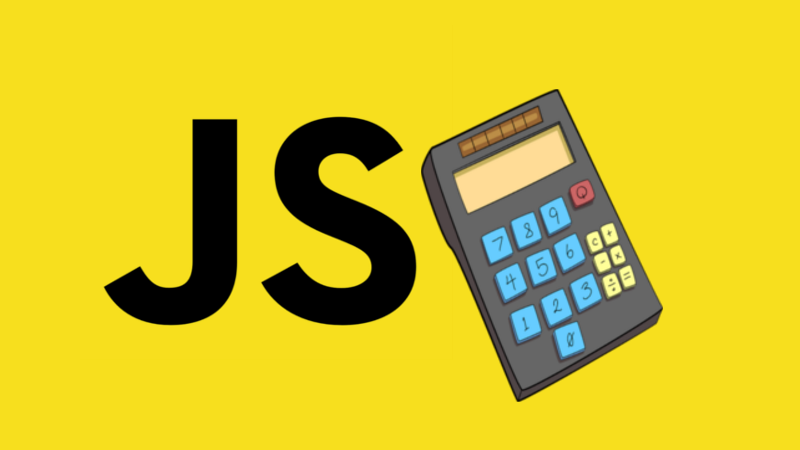

# Basic Calc - JavaScript

## Sobre
Implementação de uma calculadora básica p/ rodar no browser. O desenvolvimento foi feito durante uma das aulas do MBA ***Full Stack Development - Design, Engineering and Deployment*** na [FIAP](https://www.fiap.com.br/).

## Como usar
* Clone o repositório
* Pelo browser, abra o arquivo _index.html_.